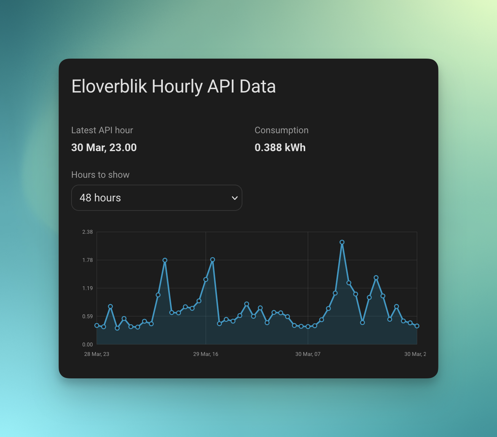

# Eloverblik Plus

Home Assistant custom integration for fetching Danish electricity consumption data
from Eloverblik / Energinet.




## Features

- Config flow setup from the Home Assistant UI
- Uses your Eloverblik refresh token and auto-discovers available metering points
- Fetches hourly consumption data from the Eloverblik API
- Exposes a sensor for the latest hourly consumption reading
- Ships a bundled Lovelace card for inspecting API-timestamped hourly points
- Preserves the fetched hourly points with start/end timestamps
- Imports hourly consumption into Home Assistant statistics for native history use
- Supports reauthentication when your refresh token changes

## Installation

### HACS

[](https://my.home-assistant.io/redirect/hacs_repository/?owner=BjornFrancke&repository=ha-eloverblik-plus&category=integration)

1. Open HACS in Home Assistant.
2. Add this repository as a custom repository.
3. Select category `Integration`.
4. Install `Eloverblik Plus`.
5. Restart Home Assistant.

### Manual

1. Copy `custom_components/eloverblik_plus` into your Home Assistant
   `custom_components` directory.
2. Restart Home Assistant.

## Configuration

Add the integration from the Home Assistant UI:

1. Go to `Settings -> Devices & services`.
2. Choose `Add integration`.
3. Search for `Eloverblik Plus`.
4. Enter your Eloverblik refresh token.
5. If your account has access to multiple metering points, choose the one you
   want to import.

You can get your refresh token from [eloverblik.dk](https://eloverblik.dk).

## Data Exposed

The integration creates two sensors per metering point:

- `Latest hourly consumption`
- `Latest hourly interval start`

`Latest hourly consumption` includes extra attributes:

- `metering_point`
- `latest_hour_api_start_utc`
- `latest_hour_api_end_utc`
- `latest_hour_start`
- `latest_hour_end`
- `window_total_kwh`
- `hourly_data`
- `daily_data`

`Latest hourly interval start` is a timestamp sensor that surfaces the API hour
used for the latest reading directly in Home Assistant. Its attributes include:

- `api_end_utc`
- `local_start`
- `local_end`

`hourly_data` contains the fetched Eloverblik interval points exactly as hourly
readings with `api_start_utc`, `api_end_utc`, `start`, `end`, and `kwh`
fields. The integration also imports those hourly points into Home Assistant
statistics using a stable external statistics ID so they can be graphed and
reused natively by Home Assistant.

`api_start_utc` and `api_end_utc` always reflect the raw API hour boundaries in
UTC. The `start` and `end` fields are converted into the timezone configured in
Home Assistant.

## Dashboard Card

This integration ships with a bundled Lovelace custom card that plots hourly
consumption using `hourly_data[*].api_start_utc` on the x-axis. This is the
recommended UI for inspecting API-timestamped points because the stock Home
Assistant entity popup graph still reflects recorder/history semantics.

In most storage-mode Lovelace setups the card resource is registered
automatically. If Home Assistant does not pick it up automatically, add the
resource manually:

```yaml
url: /eloverblik_plus/eloverblik-hourly-card.js
type: module
```

Then add the card to a dashboard:

```yaml
type: custom:eloverblik-hourly-card
entity: sensor.eloverblik_plus_999999999999999999_latest_hourly_consumption
title: Eloverblik Hourly API Data
hours_to_show: 24
```

The card also exposes a visual editor in Lovelace and will try to preselect the
first matching Eloverblik consumption entity automatically.

Card behavior:

- Reads the `hourly_data` attribute from `Latest hourly consumption`
- Uses `api_start_utc` as the plotted timestamp for each point
- Shows local start and local end timestamps in the hover tooltip using Home
  Assistant's configured timezone
- Defaults to the latest 24 hourly points, configurable with `hours_to_show`
- Includes an on-card dropdown to switch the visible hour range quickly

## Development

Run the test suite:

```bash
pytest
```

Run linting:

```bash
ruff check custom_components/ tests/
ruff format --check custom_components/ tests/
```

## Publishing Releases

For HACS, publish versioned GitHub releases so updates are easy to detect and
install.

Use the release helper from the repository root:

```bash
python release.py 0.1.2
```

What it does:

1. Verifies the git working tree is clean.
2. Updates the version and `pyeloverblik` tag reference in
   `custom_components/eloverblik_plus/manifest.json`.
3. Updates the version in `pyproject.toml`.
4. Runs `ruff check`, `ruff format --check`, and `pytest`.
5. Creates a release commit and annotated tag like `v0.1.2`.

Optional flags:

- `--dry-run` shows what would happen without changing files or git state
- `--skip-checks` skips linting and tests
- `--push` pushes the release commit and tag to `origin`
- `--github-release` creates the GitHub release via `gh` after pushing

Example:

```bash
python release.py 0.1.2 --push --github-release
```

Notes:

- Keep `manifest.json`, `pyproject.toml`, and the `pyeloverblik` dependency tag
  aligned with the release version, for example `0.1.2` and `v0.1.2`
- Do not move or reuse old tags after publishing; create a new version instead
- Use patch releases like `0.1.2` for fixes and minor releases like `0.2.0`
  for new features
